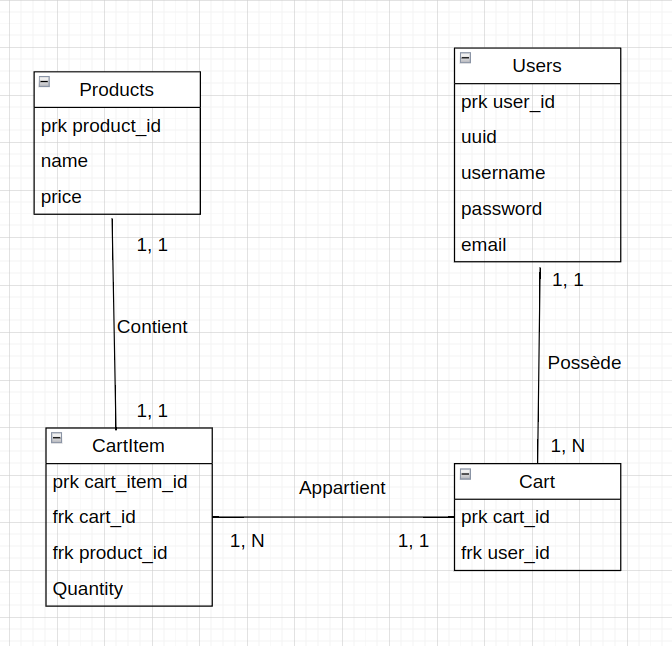

# Spécifications fonctionnelles et techniques. 

Ce document a pour but de rassembler les spécifications techniques et fonctionnelles du projet e-commerce. 

## Spécifications Techniques : 

### UML

Aucun diagramme UMl n'a été fait pour ce projet. Cependant, des classes se sont dessinées : 
- CartItem
- Cart
- Category
- Products
- Users

Chaque class a été découpée en controller et services dans le code, permettant une séparation des preoccupations. 

### Merise

## Spécifications fonctionnelles : 

### Pagination

- Page d'accueil
  - Filtre selon le type de produit
- Pages détails produits
  - Ajouter le produit dans le panier (+ choix de quantité)
- Page panier
  - Modification du panier
    - Modification quantité
    - Suppression produit
  - Valider le panier
  - Simuler un paiement pas carte bancaire
- Gestion de compte
  - Connexion
    - JWT, Cookies
    - Création de Compte
    - Modification de compte

